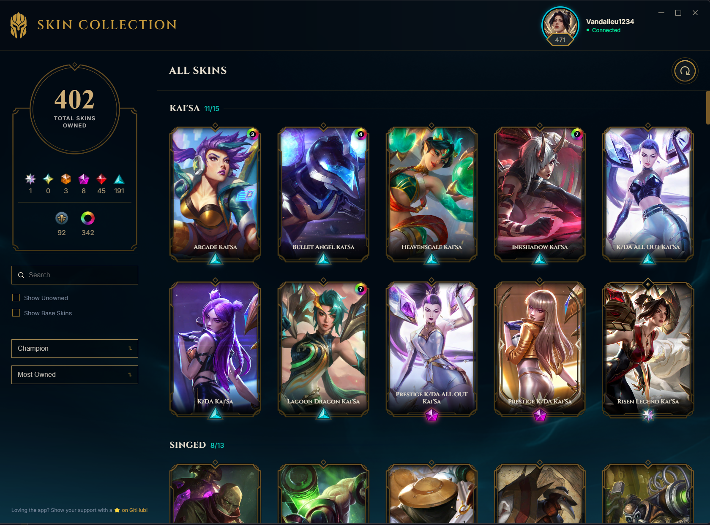
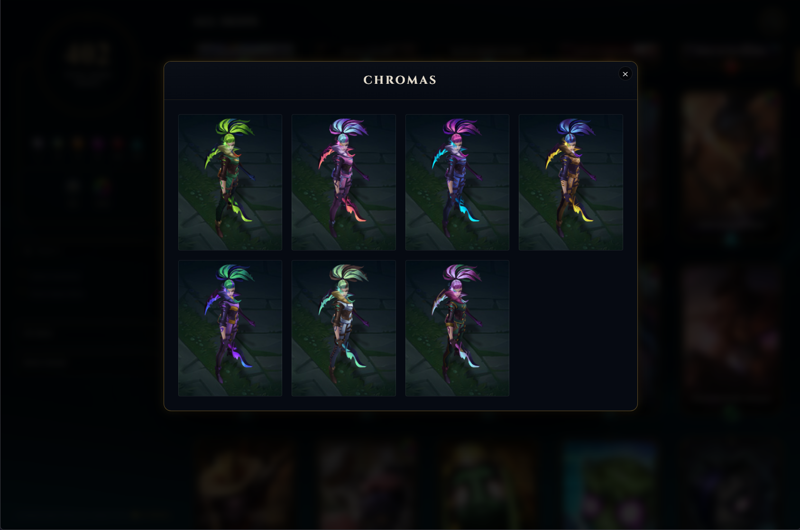
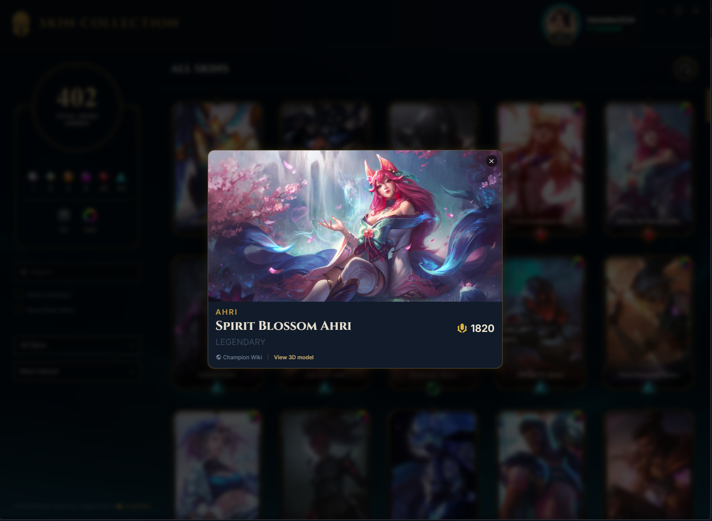

<div align="center">
  
  <h1>League of Legends Skin Viewer</h1>
  <p><em>A sleek, elegant desktop application built with Electron that displays your complete League of Legends skin collection (both owned and unowned) utilizing a native client-inspired dark theme.</em></p>
  
  <p>
    
    
    
    
  </p>
</div>


*A full view of your League of Legends skin collection, featuring the stats dashboard and sorted champions. Hover over any champion to instantly reveal all owned skins, making it incredibly easy to remember your collection and pick the highest rarity gem before a match!*

---

## ✨ Features

Our goal is to give you a beautiful, dynamic, and organized way to view your entire skin collection.

### 🎭 Full Collection View
Browse **every skin for every champion**. Owned skins are vibrantly displayed, while unowned skins are styled with a sleek, dimmed lock icon overlay.

### 📊 Stats Dashboard
Get instant insights into your collection. View your **total owned skins** and break them down by rarity tier:
*✦ Transcendent ✦ Exalted ✦ Ultimate ✦ Mythic ✦ Legendary ✦ Epic ✦ Standard*<br>
Track your precise legacy counts and total chromas accurately.

### 💎 Visual Rarity & Chromas
Each owned skin features its explicit CDragon-sourced rarity gem and border overlay. An interactive chroma count badge launches a dedicated **Chroma Gallery Modal**, showcasing unowned and owned variations dynamically loaded from Riot's CDN.


*The interactive Chroma Gallery displaying available variations for a selected skin.*

### 🎭 Detailed Skin Cards & 3D Viewing
Click on any owned skin to flip the card to view its **RP Cost** and additional details. Every skin card includes direct external links to the **League of Legends Official Wiki** for lore and the **Khada Model Viewer** to instantly view the skin's 3D model right in your browser.


*Detailed skin view showing RP costs, release details, and one-click access to 3D Khada models.*

### 💾 Offline Viewing & Caching
Check your entire skin collection without even opening the League of Legends client! The app securely caches your inventory locally, allowing you to seamlessly browse your skins offline at any time.

### 🖼️ Official Portrait Framing
Splash arts utilize the official Data Dragon `loadingUrl` slices to perfectly replicate the zoomed-out vertical bounding boxes native to the League client UI.

### 🗂️ Smart Grouping & Sorting
Keep your collection organized organically:
- **Group By:** Champion, Tier, or All.
- **Sort By:** Mastery points, Alphabetical order, or Most Owned.

*Organize your collection exactly how you want it with smart filtering.*

### ⚡ Instant Client Detection
The app automatically scans your drives and processes to seamlessly detect your running League of Legends client and securely extract the necessary API credentials.

---

## 🚀 Quick Start

Get up and running in under a minute!

### Requirements
- **OS:** Windows 10/11
- **Game:** League of Legends client (Running and logged in)
- *(For building from source only)* Node.js ≥ 18

### Installation

#### Option 1: Download from Release (Recommended)
The easiest way to get started. No development knowledge required!
1. Navigate to the **[Releases](../../releases)** tab on GitHub.
2. Download the latest `LOL-Skin-Viewer-Setup-x.x.x.exe` file.
3. Run the installer and launch the app.
4. *(Ensure your League Client is open and logged in!)*

#### Option 2: Build from Source
If you prefer to compile the application yourself or want to contribute:

```bash
# Clone the repository
git clone https://github.com/your-username/LOL_skin_viewer.git
cd LOL_skin_viewer

# Install required dependencies
npm install

# Start the application locally (Ensure your League Client is open!)
npm start
```

---

## 🛠️ How It Works

1. **LCU API (League Client Update)**: The application utilizes intelligent PowerShell and WMI scripts to securely find your League `lockfile` across all drives. It then authenticates against the local LCU API to fetch your real-time inventory and mastery data.
2. **Data Dragon (DDragon)**: Pulls static champion metadata, tile splash arts, and profile images directly from Riot's reliable global CDN.
3. **CommunityDragon (CDragon)**: Acts as the authoritative source for skin rarity classifications and legacy identifiers, mapping unstandardized internal Riot variables into recognizable UI gems and strict Vault tracking.

---

## 💻 Developer Scripts

| Command | Description |
| :--- | :--- |
| `npm start` | Launch the Electron application |
| `npm run lint` | Run ESLint rules against the codebase |
| `npm run format` | Format code beautifully with Prettier |

---

## 🏗️ Project Structure

A clean, modular layout ensuring maintainability and separation of concerns:

```text
LOL_skin_viewer/
├── main.js          # Electron main process (LCU discovery, IPC API, data aggregation)
├── preload.js       # Secure context bridge API
├── renderer.js      # Frontend logic (Filtering, rendering, dropdowns, DOM)
├── index.html       # Primary layout
├── css/             # Modular CSS structure
│   ├── variables.css      # Core tokens
│   ├── layout.css         # App layout boundaries
│   ├── sidebar.css        # Control dashboard
│   ├── skin-card.css      # Splashes, borders, overlays
│   └── ...           
├── assets/          # Static CDragon overlays and icons
└── AGENTS.md        # Technical architecture documentation for AI agents
```

---

## 🔒 Privacy & Security

**Your data stays yours.** This app runs completely locally on your machine. 

It only interfaces with:
- **`127.0.0.1` (localhost)**: For the authorized League Client API.
- **Riot Games CDN**: For public image assets.

**Zero personal data is sent to external or third-party servers.** All parsed collections are safely cached locally within your user's AppData directory for fast offline access.

---

## 🙏 Credits

This application is made possible thanks to the amazing tools and data provided by the League of Legends community:
- **[Riot Data Dragon (DDragon)](https://developer.riotgames.com/docs/lol)** — For official champion metadata, splashes, and profile icons.
- **[CommunityDragon (CDragon)](https://communitydragon.org/)** — For authoritative unstandardized rarity classifications, Vault status, and UI assets.
- **[League of Legends Official Wiki](https://leagueoflegends.fandom.com/wiki/League_of_Legends_Wiki)** — For comprehensive lore data and external referencing.

---

<div align="center">
  <p>Built with ❤️ by the community. Not endorsed by Riot Games.</p>
  <p>Distributed under the <strong>MIT License</strong>.</p>
</div>
