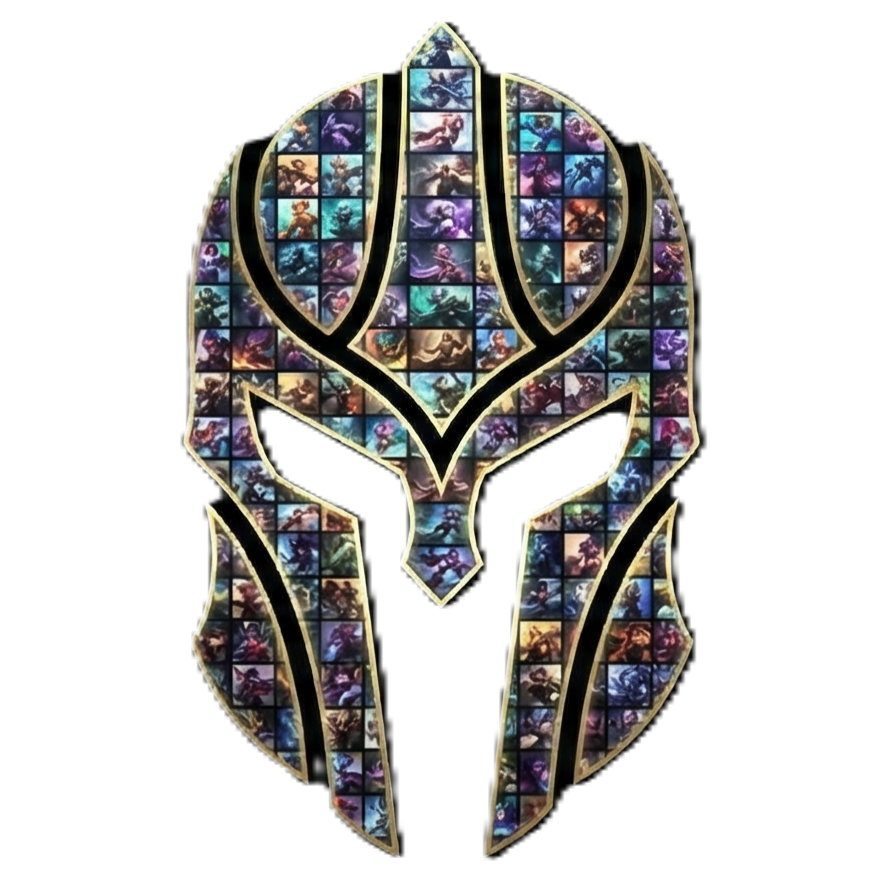
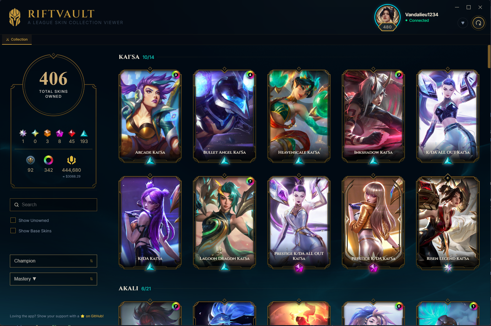
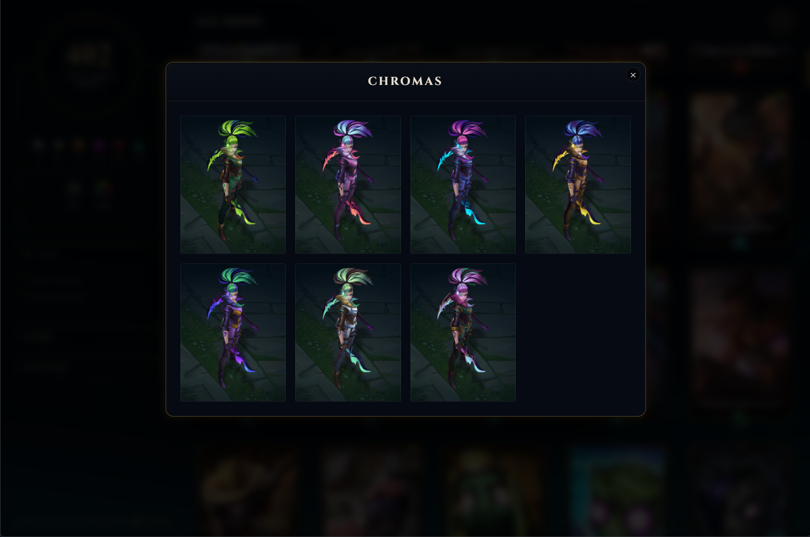
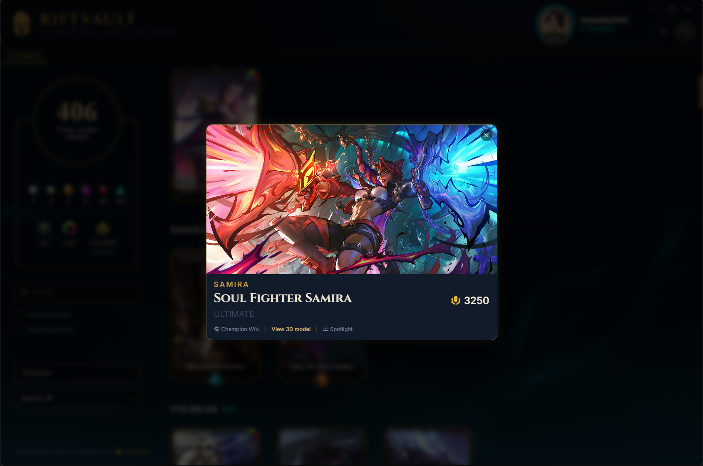
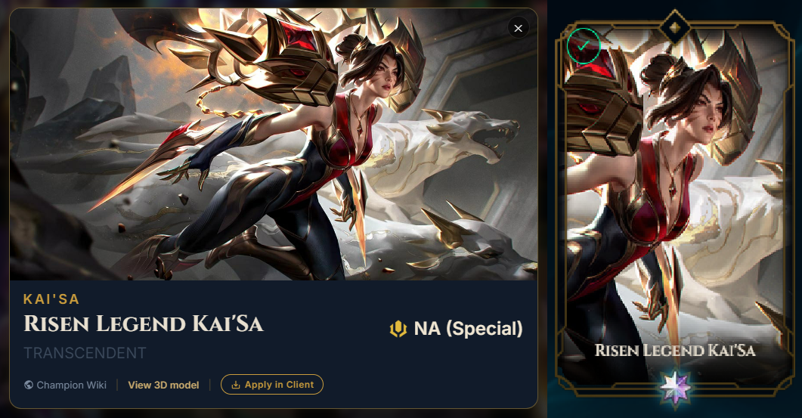
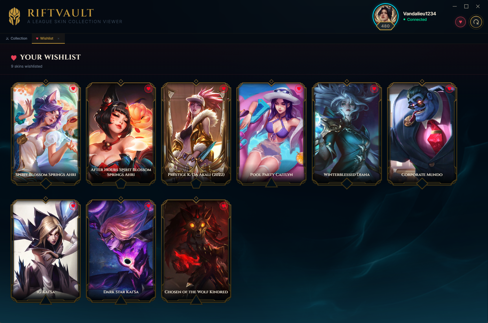
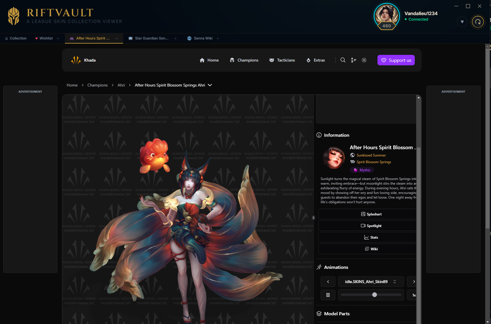
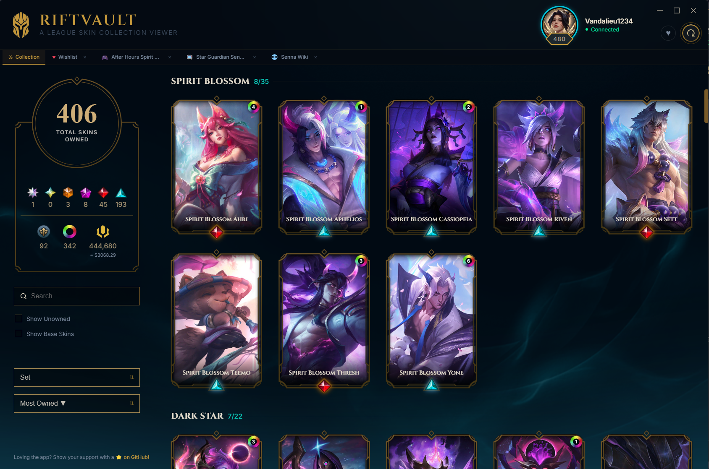

<div align="center">
  
  <h1>RiftVault</h1>
  <p><em>A League Skin Collection Viewer — A sleek, elegant desktop application built with Electron that displays your complete League of Legends skin collection (both owned and unowned) utilizing a native client-inspired dark theme.</em></p>
  
  <p>
    
    
    
    
  </p>
</div>


*A full view of your League of Legends skin collection, featuring the stats dashboard and sorted champions. Hover over any champion to instantly reveal all owned skins, making it incredibly easy to remember your collection and pick the highest rarity gem before a match!*

---

## ✨ Features

Our goal is to give you a beautiful, dynamic, and organized way to view your entire skin collection.

### 🎭 Full Collection View
Browse **every skin for every champion**. Owned skins are vibrantly displayed, while unowned skins are styled with a sleek, dimmed lock icon overlay.

### 📊 Stats Dashboard
Get instant insights into your collection. View your **total owned skins** and break them down by rarity tier:
*✦ Transcendent ✦ Exalted ✦ Ultimate ✦ Mythic ✦ Legendary ✦ Epic ✦ Standard*<br>
Track your precise legacy counts and total chromas accurately.

### 💎 Visual Rarity & Chromas
Each owned skin features its explicit CDragon-sourced rarity gem and border overlay. An interactive chroma count badge launches a dedicated **Chroma Gallery Modal**, showcasing unowned and owned variations dynamically loaded from Riot's CDN.


*The interactive Chroma Gallery displaying available variations for a selected skin.*

### 🎭 Detailed Skin Cards & 3D Viewing
Click on any owned skin to flip the card to view its **RP Cost** and additional details. Every skin card includes direct external links to the **League of Legends Official Wiki** for lore and the **Khada Model Viewer** to instantly view the skin's 3D model right in your browser.


*Detailed skin view showing RP costs, release details, and one-click access to 3D Khada models.*

### 🎮 Apply Skin In-Client
During champion select, **apply any owned skin directly from RiftVault** to your League client with a single click. The app detects when you've locked in a champion and shows a contextual "Apply in Client" button — both on the skin card grid and inside the detail modal. Real-time polling tracks which skin is currently equipped, and the window auto-surfaces itself on lock-in so the controls are right there waiting.


*The Apply in Client button appears on skin cards and in the modal after locking in a champion during champ select.*

### ❤️ Wishlist
Click the heart on any unowned skin to save it to a personal wishlist. A dedicated **Wishlist tab** gives you a clean grid of every skin you're chasing, with a live count. The list persists locally and auto-prunes the moment a skin becomes owned.


*The Wishlist tab — every skin you're hunting, in one place.*

### 🌐 In-App Browser Tabs
External links no longer eject you to your default browser. The **Champion Wiki**, **Khada 3D Model Viewer**, and the **Skin Spotlight** YouTube search all open as tabs *inside* RiftVault. The tab bar across the top supports up to 8 simultaneous tabs and lets you flip between research and your collection without breaking flow.


*Wiki, 3D model viewer, and Skin Spotlight links open as in-app tabs — no context switching.*

### 💾 Offline Viewing & Caching
Check your entire skin collection without even opening the League of Legends client! The app securely caches your inventory locally, allowing you to seamlessly browse your skins offline at any time.

### 🖼️ Official Portrait Framing
Splash arts utilize the official Data Dragon `loadingUrl` slices to perfectly replicate the zoomed-out vertical bounding boxes native to the League client UI.

### 🗂️ Smart Grouping & Sorting
Keep your collection organized organically:
- **Group By:** All, Champion, **Set** (skin line / universe), or Tier.
- **Sort By:** Mastery points, Most Owned, **Most Complete %**, or Alphabetical. (`All` and `Tier` modes lock the sort to the only meaningful order.)
- Group headers light up when you've collected every skin in that group.


*Group by Set to chase down themed skin lines — Star Guardian, PROJECT, K/DA, and more.*

### 💰 Collection RP Value
A live mini-stat in the sidebar that sums up the RP cost of every owned non-base skin in your collection, with an approximate USD value alongside. A satisfying glance at how much you've invested in the Rift.

### 🪟 System Tray
Closing the window hides RiftVault to the system tray instead of quitting it — handy if you want it ready to go for the next champion select without taking up taskbar space. Right-click the tray icon to re-open or quit.

### ⚡ Instant Client Detection
The app automatically scans your drives and processes to seamlessly detect your running League of Legends client and securely extract the necessary API credentials.

---

## 🚀 Quick Start

Get up and running in under a minute!

### Requirements
- **OS:** Windows 10/11
- **Game:** League of Legends client (Running and logged in)
- *(For building from source only)* Node.js ≥ 18

### Installation

#### Option 1: Download from Release (Recommended)
The easiest way to get started. No development knowledge required!
1. Navigate to the **[Releases](../../releases)** tab on GitHub.
2. Download the latest `RiftVault-Setup-x.x.x.exe` file.
3. Run the installer and launch the app.
4. *(Ensure your League Client is open and logged in!)*

#### Option 2: Build from Source
If you prefer to compile the application yourself or want to contribute:

```bash
# Clone the repository
git clone https://github.com/arjun-arihant/RiftVault.git
cd RiftVault

# Install required dependencies
npm install

# Start the application locally (Ensure your League Client is open!)
npm start
```

---

## 🛠️ How It Works

1. **LCU API (League Client Update)**: The application utilizes intelligent PowerShell and WMI scripts to securely find your League `lockfile` across all drives. It then authenticates against the local LCU API to fetch your real-time inventory and mastery data (with multi-endpoint fallbacks to stay resilient as Riot iterates the LCU).
2. **Data Dragon (DDragon)**: Pulls static champion metadata, tile splash arts, and profile images directly from Riot's reliable global CDN.
3. **CommunityDragon (CDragon)**: Acts as the authoritative source for skin rarity classifications, legacy identifiers, and **skin-line metadata** — mapping unstandardized internal Riot variables into recognizable UI gems, strict Vault tracking, and the named groups powering the Set view (`skins.json` + `skinlines.json`).

---

## 💻 Developer Scripts

| Command | Description |
| :--- | :--- |
| `npm start` | Launch the Electron application |
| `npm run dev` | Launch with the `--dev` flag |
| `npm run build` | Build the Windows portable executable to `dist/` |
| `npx eslint .` | Lint the codebase |
| `npx prettier . --write` | Format the codebase |

---

## 🏗️ Project Structure

A clean, modular layout ensuring maintainability and separation of concerns:

```text
RiftVault/
├── main.js          # Electron main process (LCU discovery, IPC API, data aggregation)
├── preload.js       # Secure context bridge API
├── renderer.js      # Frontend logic (Filtering, rendering, dropdowns, DOM)
├── index.html       # Primary layout
├── css/             # Modular CSS structure
│   ├── variables.css      # Core tokens
│   ├── layout.css         # App layout boundaries
│   ├── sidebar.css        # Control dashboard
│   ├── skin-card.css      # Splashes, borders, overlays
│   ├── tabs.css           # In-app tab bar + webview panes
│   └── ...           
├── assets/          # Static CDragon overlays and icons
└── AGENTS.md        # Technical architecture documentation for AI agents
```

---

## 🔒 Privacy & Security

**Your data stays yours.** This app runs completely locally on your machine. 

It only interfaces with:
- **`127.0.0.1` (localhost)**: For the authorized League Client API.
- **Riot Games CDN**: For public image assets.

**Zero personal data is sent to external or third-party servers.** All parsed collections are safely cached locally within your user's AppData directory for fast offline access.

---

## 🙏 Credits

This application is made possible thanks to the amazing tools and data provided by the League of Legends community:
- **[Riot Data Dragon (DDragon)](https://developer.riotgames.com/docs/lol)** — For official champion metadata, splashes, and profile icons.
- **[CommunityDragon (CDragon)](https://communitydragon.org/)** — For authoritative unstandardized rarity classifications, Vault status, and UI assets.
- **[League of Legends Official Wiki](https://leagueoflegends.fandom.com/wiki/League_of_Legends_Wiki)** — For comprehensive lore data and external referencing.

---

<div align="center">
  <p>RiftVault was created under Riot Games' <a href="https://www.riotgames.com/en/legal">"Legal Jibber Jabber"</a> policy using assets owned by Riot Games. Riot Games does not endorse or sponsor this project.</p>
  <p>Distributed under the <strong>MIT License</strong>.</p>
</div>

---

## ⚖️ Achievements & Curator Picks — Legal Notes

**Achievements** are purely local and reference only Riot IP (champion names, skin names, skin lines, rarities). This is covered by the existing Riot Legal Jibber Jabber attribution above.

**Curator Picks** reference real content creators by name as factual commentary (e.g. "X has publicly stated this is their favourite skin"). This is used under nominative fair use / commentary principles. The following applies to all Curator Picks entries:

- RiftVault is **not affiliated with, sponsored by, or endorsed by** any named streamer or content creator.
- No streamer photos, logos, channel art, or branding are used — only their publicly stated name as part of a factual claim.
- Each entry in `curator-picks.json` includes a `sourceUrl` pointing to the public statement the claim is based on.
- **Takedown requests:** If you are a content creator named in `curator-picks.json` and wish to be removed, open an issue or pull request at [github.com/arjun-arihant/RiftVault](https://github.com/arjun-arihant/RiftVault) or contact the maintainer directly. Removal is handled by adding your entry's `id` to `curator-takedowns.json`, which takes effect on the next app update.

**Share cards** generated by the Achievements feature include a "Not endorsed by Riot Games" attribution and, for Curator Picks, the per-entry disclaimer from `curator-picks.json`.
